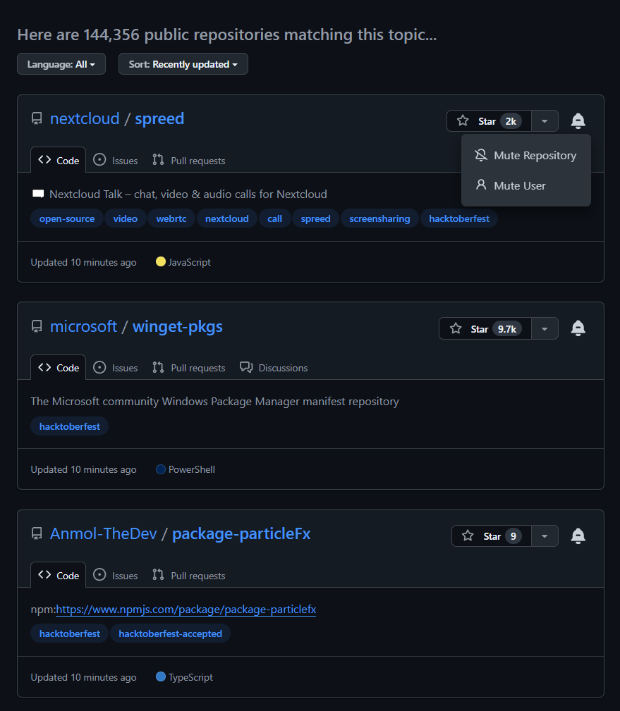

# GitHub Topic Mute

A Chrome extension that lets you mute specific repositories and users on GitHub topic pages.

## Installation

1. Clone this repository
2. Open Chrome and navigate to `chrome://extensions/`
3. Enable "Developer mode"
4. Click "Load unpacked" and select the extension folder

## Usage

1. Visit any GitHub topic page (e.g., `github.com/topics/javascript`)
2. Click the bell icon on any repository card
3. Select "Mute Repository" or "Mute User"
4. View and manage muted items via the extension popup

## Unmuting

Click the extension icon in your toolbar to see all muted items. Click "Unmute" next to any item to restore it.
